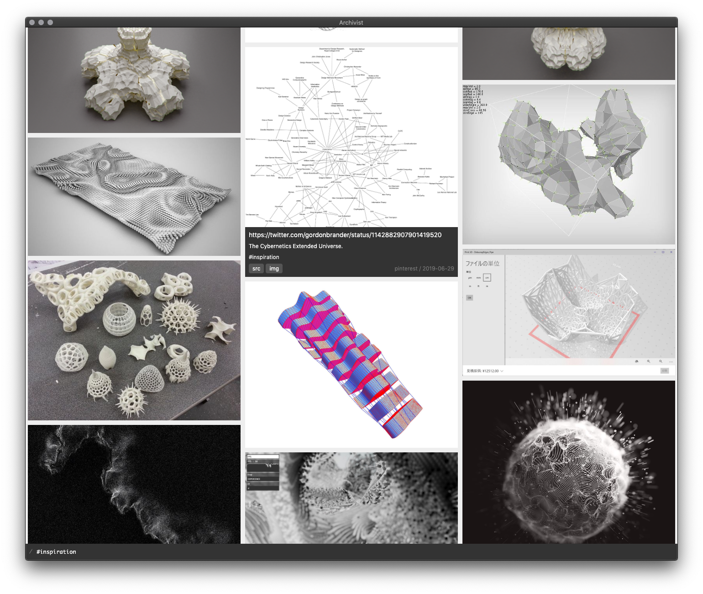

# Archivist

Tool for archiving and browsing.

Built out of a need to get out of walled gardens of Pinterest and (much less walled) Pinboard.

**Alpha quality at best.**

<p align="center"></p>

## Modules

Archivist is built out of three interconnected parts (each package has it's own readme file):

1. [`archivist-cli`](./archivist-cli) - command line tool for configuration, fetching and querying the data
2. [`archivist-ui`](./archivist-ui) - Electron UI built on top of `archivist-cli`
3. `archivist-*` - various crawlers, "official" ones:
    - [`archivist-pinboard`](./archivist-pinboard) - API-based Pinboard archiving: screenshot and [freeze-dry](https://github.com/WebMemex/freeze-dry) of the original website
    - [`archivist-pinterest-crawl`](./archivist-pinterest-crawl) - slowly crawl through Pinterest and archive pin image

## Installation

1. `npm install -g archivist-cli`
2. to archive pinboard: `npm install -g archivist-pinboard`
3. to archive pinterest: `npm install -g archivist-pinterest-crawl`

`archivist-ui` is not on npm (it should probably be a downloadable `dmg`/`exe`, but I didn't get around to it), so to run it:

1. clone this repo
2. `cd archivist-ui && npm install && npm start`

## Configure

```bash
$ archivist config
```

Config is a JSON object of shape:

```json
{
  "crawler-1": CRAWLER_1_OPTIONS,
  "crawler-2": CRAWLER_2_OPTIONS,
  ...
}
```

Example config (assuming Pinboard and Pinterest backup):

```json
{
  "archivist-pinterest-crawl": {
    "loginMethod": "cookies",
    "profile": "szymon_k"
  },
  "archivist-pinboard": {
    "apiKey": "API_KEY_FOR_PINBOARD"
  }
}
```

For detailed configuration option look at the crawler info.

## Usage

- backup data: `archivist fetch` (might take a long time depending on the size of the archive)
- list everything: `archivist query`
  - find everything about keyboards: `archivist query keyboard`
  - `query` by default returns `ndjson`, normal JSON can be outputed using `--json`

## References

- [kollektor](https://github.com/vorg/kollektor) - no-ui self-hosted Pinterest clone
- gwern on [archiving URLs](https://www.gwern.net/Archiving-URLs)
- [freeze-dry implementation notes](https://github.com/WebMemex/freeze-dry/blob/master/src/Readme.md)

