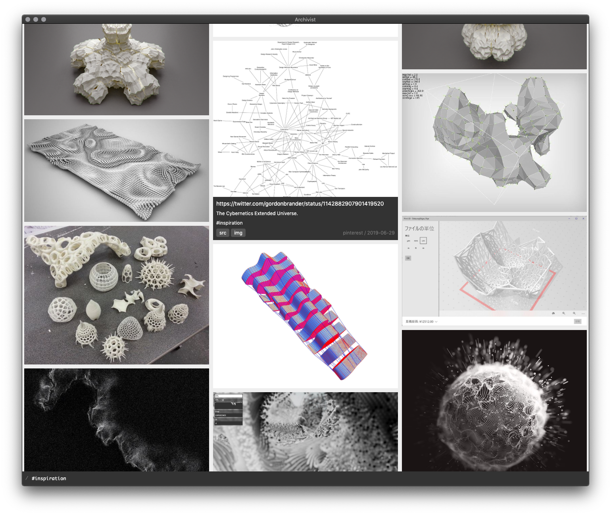

# Archivist

Tool for archiving and exploring.

<p align="center"></p>

## Sources

- **Pinboard** -- API-based archiving: screenshots via Puppeteer, [freeze-dry](https://github.com/WebMemex/freeze-dry) HTML archives, fulltext extraction
- **Pinterest** -- web crawler with stealth Puppeteer, downloads pin images
- **Screenshot** -- indexes a local directory (e.g. Dropbox), extracts metadata from macOS Finder comments (xattr)

## Setup

```bash
npm install
npm run build
```

## Configure

```bash
npm run cli -- config
```

Config at `~/.config/archivist/config.json`:

```json
{
  "pinboard": {
    "apiKey": "API_TOKEN_FROM_PINBOARD"
  },
  "pinterest": {
    "loginMethod": "cookies",
    "profile": "your_username"
  },
  "screenshot": {
    "directory": "/path/to/screenshots"
  }
}
```

Pinterest supports `"loginMethod": "password"` with `"username"` and `"password"` fields as an alternative to cookies.

Pinboard requires an API token from https://pinboard.in/settings/password.

## Usage

```bash
npm run cli -- fetch              # fetch all sources
npm run cli -- fetch screenshot   # fetch one source
npm run cli -- search keyboard    # CLI search
npm run serve                     # start web UI (after build)
npm run dev                       # dev mode (watch + HMR)
npm run test                      # run tests
```

## References

- [kollektor](https://github.com/vorg/kollektor) -- no-ui self-hosted Pinterest clone
- gwern on [archiving URLs](https://www.gwern.net/Archiving-URLs)
- [freeze-dry](https://github.com/WebMemex/freeze-dry) -- HTML archiving
- [sqlite-vec](https://github.com/asg017/sqlite-vec) -- vector search for SQLite
